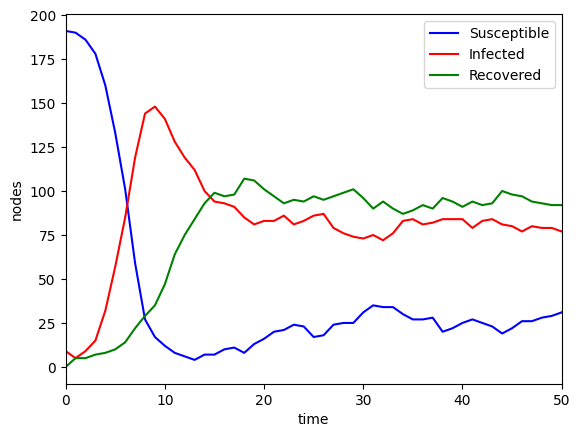
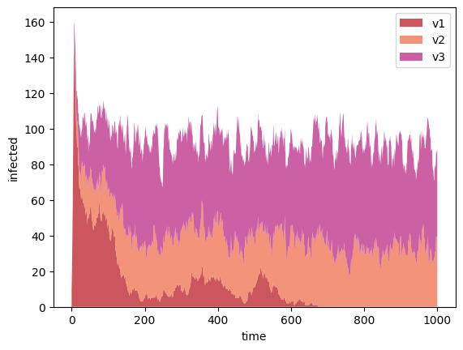

# SIRS model on graphs
## Graph class
The class implements a graph data structure via an **adjacency map**, providing a great trade-off in performance. It allows one to do all the basic operations with nodes and edges. 

The custom class constructor can generate a scale-free network following the **Barabasi-Albert model** with $n$ vertices. The hyperparameters of the model are the initial number of vertices $n_0$ and the number of edges $m$ created at each iteration.

## Monte Carlo simulation
Each time step simulates the spread and mutation of a virus via the edges of the network, starting from one patient zero. Each _susceptible subject_ in the neighborhood of an infected individual has a probability $\beta$ of being infected. Each infected patient has some probability $\gamma$ of being recovered or changing variants (_virus mutations_). These probabilities are depending on the virus variant. There is also a time-dependent probability $\delta$ of becoming susceptible again after the recovery, allowing _reinfection_. 

From a computational point of view, the status of a node is defined by an integer. Positive values mean infection (fixed values for each variant), negative values mean that the patient is recovered (decreasing each time step the subject is still recovered), and zeros for susceptible individuals. 

## Visualization
Here are some visualizations of the coupled dynamics of a $n=200$ network. In the graph animation, the blue dots are susceptible subjects, the red ones are infected (with different variants) and the green ones are recovered (darker green for time dependence). 

  

On the left, the number of subjects susceptible, infected, or recovered in the initial time steps. After that, the system converges to a dynamic equilibrium. On the right, the rate of different variants in the population. 

  
  

